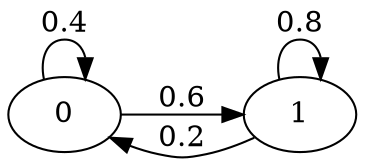

## 1.1.3

Eine Rechnerkomponente (K) sei zu den Zeitpunkten $t in N$ aktiv (=1) oder inaktiv (=0). Zur Zeit $t = 0$ sei K inaktiv. Falls K für $t = n$ aktiv ist, sei K zur Zeit $t = n+1$ mit Wahrscheinlichkeit $0,8$ ebenfalls aktiv, wenn K inaktiv ist, sei es beim nächsten Takt mit Wahrscheinlichkeit $0,6$ aktiv. Es sei $X_n$ die hierdurch bestimmte Markov-Kette.

a) Man gebe die Übergangsmatrix und den Übergangsgraphen an.

$P=[[0.8,0.2],[0.6,0.4]]$

b) Bestimmen Sie mit Hilfe von Scilab den Vektor $vec p_n = (P(X_n = 0 ), P( X_n = 1  ))$ für $n = 1, 2, 4, 8, 16$ und visualisieren Sie das Ergebnis in einem geeigneten Diagramm.

$p1=p0 * P^1=(0.76, 0.24)$

$p2=p0 * P^2=(0.752, 0.248)$

$p4=p0 * P^4=(0.75008, 0.24992)$

$p8=p0 * P^8=(0.750001, 0.2499999)$

$p16=p0 * P^16=(0.75,0.25)$

c) Ist die Markov-Kette irreduzibel? Ist sie aperiodisch?

Ja
