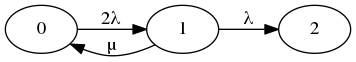

## 2.5.1

Es soll die im Skriptum 2.5.6 angegebene Formel für die MTTDL bei RAID 1-Konfigurationen hergeleitet werden:

### a) Erstellen Sie dazu einen Markovschen Übergangsgraphen!

### b) Berechnen Sie die exakte MTTDL!

???

$A_0=(lambda_1+mu_1)/(lambda_0 * lambda_1) = $

### c) Wieso ist die im Skriptum angegebene Näherung gerechtfertigt?

$"MTTF"/n$ ist zu vernachlässigen, da verschwindend gering.