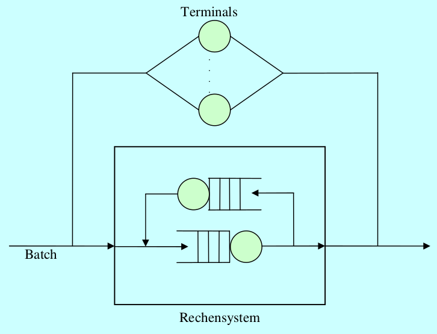

## 3.2.7

Die Arbeitslast der vorherigen Aufgabe werde folgendermaßen modifiziert:
- die Zahl der Terminalbenutzer steige auf 40,
- ihre mittlere Denkzeit ist 15 s,
- die mittlere Dialogantwortzeit sei 5 s,
- die mittlere Bedienzeit der einen Magnetplatte sei 20 ms,
- jeder Dialogauftrag erzeugt durchschnittlich zehn Plattenzugriffe.

Zusätzlich zu der Dialoglast existiere nun eine Batch-Last. Die einzelnen Batch-Aufträge betreten das System, werden von ihm bearbeitet, und verlassen es wieder. Dabei erzeugt jeder Batch-Auftrag durchschnittlich fünf Plattenzugriffe. Messungen ergaben, dass die Magnetplatte zu 90 % ausgelastet ist.

## a) Skizzieren Sie die Situation in einem geeigneten Graphen!

Stimmt das ???

## b) Berechnen Sie den Dialogdurchsatz $X’$!

$X=N/(bar V + bar Z)=40/(5s + 15s)=2/s$

## c) Berechnen Sie den gesamten Plattendurchsatz $X_(P,"ges")$ !

$U_P=0.9$

$X_(P,"ges")=U_P/bar S_P=0.9/(20ms)=45/s$

Man darf hier U als Durchsatz X verwenden, weil U < 1.

## d) Berechnen Sie den durch den Dialogverkehr verursachten Plattendurchsatz $X’ _P$!

$X_P'=e_P' * X' = 10 * 2/s=20/s$

## e) Berechnen Sie den Stapeldurchsatz X durch das System!

$X_P+X_P'=X_(P, "ges")$

$=> X_P=X_(P, "ges") - X_P'=(45-20)/s=25/s$

$X=X_P/e_P=(25/s)/5=5/s$