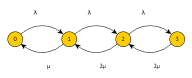

# Prüfung SS 16

> Angaben teils unvollständig und fehlerhaft.

## 1.

Gegeben ist ein $M//M//2//1//oo//FCS$ System. Ankunftsrate sei $lambda$ und Bedienrate $mu$.

### a)

Zeichnen Sie ein geeignetes Übergangsdiagramm. Was bedeuten die Zustände?

0: 0 im System

1: 1 Auftrag im System (1 aktiv, 0 warten)

2: 2 Auftrag im System (2 aktiv, 0 warten)

3: 3 Auftrag im System (2 aktiv, 1 warten)

### b)

Wie lauten die Übergangswahrscheinlichkeiten. Verwenden Sie hierfür $a = lambda/mu$.

### c)

## 2. Arztpraxis

In einer Arztpraxis kommen Kunden mit der Rate $lambda$ an. Wenn mehr als 2 Patienten im Wartezimmer sind, geht die Hälfte der Patienten sofort wieder. Die Zeit die der eine Arzt pro Patient benötigt ist $bar S$. Wenn der Arzt ins Wartezimmer sieht und dort mehr als 2 Patienten sind, halbiert der Arzt seine Bearbeitungszeit.

### a)

Zeichnen Sie den Übergangsgraphen.

### b)

Unter welcher Bedingung (in Abhängigkeit von $bar S$) gibt es eine Gleichgewichtslösung? Keine Berechnung notwendig.

## 3. Gegeben sei folgendes HMKD:

### a) 

Geben Sie die Übergangsmatrix an.

### b)

Wie lauten die Übergangswahrscheinlichkeiten?

## 4. Wartungsnetz

Gegeben ist eine Anwendungsarchitektur als Wartenetz. Ein Netzserver (N) nimmt von außen Aufträgt von Clients an und leitet diese an ein SAP System weiter. Das SAP System erstellt pro Benutzerauftrag zwei Anfragen an einen DB Server (DB). Das SAP System kommuniziert dabei über den Netzserver mit dem DB Server. Der DB Server liefert kommuniziert ebenfalls über den Netzserver mit dem SAP System. Anschließend sendet das SAP System die Anfrage über das lokale Netzwerk nach außen.

### a) Zeichnen Sie ein geeignetes Wartenetz.

### b) Wie viele Besuche gibt es im Mittel am lokalen Netzwerk und am SAP System?

SAP: $"DB" + 1 = 3$

N: $1 + "SAP" + "DB" = 6$

## 5. 

Erzeuger Verbraucher mit Puffergröße N=4. Der Erzeuger legt beim Erzeugen 2 Elemente ab. Wenn nurnoch Platz für ein Element existiert, legt er nur eines ab. Ist kein Platz, legt er nichts ab. Erzeugt wird mit Wahrscheinlichkeit $p=1/2$. Der Verbraucher verbraucht mit Wahrscheinlichkeit 1 - p ein Element.